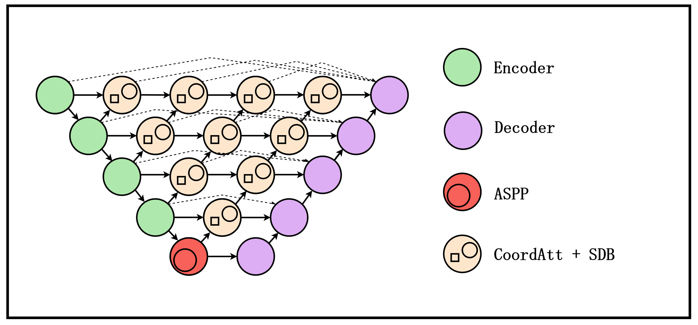

# SDCANet

[](https://opensource.org/licenses/Apache-2.0)

SDCANet (Strip-Differential Coordinate Attention Network) is a semantic segmentation model designed for extracting fine-grained features, originally optimized for erosion gully segmentation.

It leverages **Res2Net** as a backbone and introduces the **Strip Diff Block (SDB)** to capture long-range dependencies and boundary details using strip convolutions and difference features.

## Key Features

*   **Backbone**: Res2Net50 (pretrained) for robust feature extraction.
*   **Strip Diff Block (SDB)**: A custom module that captures directional features (horizontal/vertical/standard) and calculates feature differences to highlight boundaries.
*   **Coordinate Attention**: Integrated within SDB to enhance spatial awareness along channel dimensions.
*   **Deep Supervision**: Includes auxiliary heads during training for better convergence.
*   **Multi-Channel Support**: Capable of handling N-channel inputs (e.g., multispectral data), not just standard RGB.

## Architecture



The network follows an Encoder-Decoder structure:
1.  **Encoder**: Res2Net50 + ASPP (Atrous Spatial Pyramid Pooling).
2.  **Feature Fusion**: SDBs are used to fuse features from adjacent stages (e.g., `x5` and `x4`) and capture the "difference" information.
3.  **Decoder**: Multi-level upsampling and fusion to restore spatial resolution.

## Getting Started

### 1. Requirements

```bash
pip install -r requirements.txt
```

### 2. Data Preparation

Organize your dataset as follows. The `Datainit` loader supports `.jpg`, `.png`, and `.tif` (for multi-channel data).

```text
TrainData/
├── images/
│   ├── train_images/  # Training images
│   ├── val_images/    # Validation images
│   └── test_images/   # Test images
└── labels/
    ├── train_labels/  # Masks (0, 1, ...)
    ├── val_labels/    # Masks
    └── test_labels/   # Masks
```

### 3. Configuration

Modify `config.py` to match your dataset and hardware:

*   `IN_CHANNELS`: Set to **3** for RGB, or **N** for multispectral.
*   `NUM_CLASSES`: Number of target classes (including background).
*   `NORM_MEAN` / `NORM_STD`: **Important for multi-channel**. Run `python calculate_mean_std.py` to compute these for your custom dataset.
*   `BATCH_SIZE` & `LR`: Adjust based on your GPU memory.

### 4. Training

Run the training script. This will automatically validate after each epoch and save the best model to `./output/`.

```bash
python run-train.py
```

To switch models (e.g., to UNet or DeepLabV3+ for comparison), modify the `main()` function in `run-train.py`.

### 5. Inference / Prediction

Use the trained model to predict new images:

```bash
python run-predict.py
```

Check `interface/predict.py` to point to your specific checkpoint path.

## Code Structure

*   `models/`: Contains SDCANet and other comparison models (UNet, SegNet, etc.).
*   `utils/Dataset.py`: Custom dataset loader with N-channel support.
*   `utils/augmentation.py`: Albumentations-based data augmentation.
*   `module/`: Loss functions (DiceFocalLoss).

## License

This project is licensed under the [Apache License 2.0](LICENSE).
